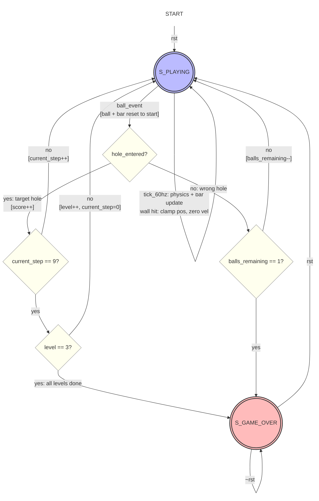

## Game State Machine

```mermaid
graph TD
    %% Entry point
    Start((START))

    %% Real register states (game_state_machine.v)
    S_PLAYING(((S_PLAYING)))
    S_GAME_OVER(((S_GAME_OVER)))

    %% Combinational decisions — resolved within one clock edge
    D_TARGET{"hole_entered?"}
    D_STEP{"current_step == 9?"}
    D_LEVEL{"level == 3?"}
    D_LIVES{"balls_remaining == 1?"}

    %% Styling
    style Start fill:#fff,stroke:#fff,stroke-dasharray: 5 5
    style S_PLAYING fill:#bbf,stroke:#333,stroke-width:2px
    style S_GAME_OVER fill:#fbb,stroke:#333,stroke-width:2px
    style D_TARGET fill:#ffe,stroke:#999
    style D_STEP fill:#ffe,stroke:#999
    style D_LEVEL fill:#ffe,stroke:#999
    style D_LIVES fill:#ffe,stroke:#999

    %% Reset
    Start -->|"rst"| S_PLAYING

    %% Physics self-loop — runs every tick_60hz (~60 Hz)
    S_PLAYING -->|"tick_60hz: physics + bar update\nwall hit: clamp pos, zero vel"| S_PLAYING

    %% ball_event fires — ball_physics + bar_controller reset instantly
    S_PLAYING -->|"ball_event\n[ball + bar reset to start]"| D_TARGET

    %% Success path
    D_TARGET -->|"yes: target hole\n[score++]"| D_STEP
    D_STEP -->|"no\n[current_step++]"| S_PLAYING
    D_STEP -->|"yes"| D_LEVEL
    D_LEVEL -->|"no\n[level++, current_step=0]"| S_PLAYING
    D_LEVEL -->|"yes: all levels done"| S_GAME_OVER

    %% Fail path
    D_TARGET -->|"no: wrong hole"| D_LIVES
    D_LIVES -->|"no\n[balls_remaining--]"| S_PLAYING
    D_LIVES -->|"yes"| S_GAME_OVER

    %% Game over
    S_GAME_OVER -->|"~rst"| S_GAME_OVER
    S_GAME_OVER -->|"rst"| S_PLAYING
```
